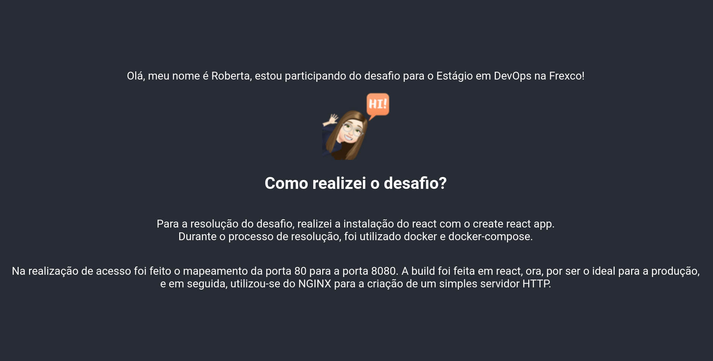

<h1 align="center"> FREXCO DEVOPS</h1> 
É uma aplicação que foi desenvolvida em React com intuito de fazer um deploy através de container Docker.  

  

## 🛠 Ferramentas
- Docker
- Docker-compose
- NGINX
- React

## 🤔 Qual era o desafio?
O foco do desafio era no deploy em React, que deveria ser realizado através de containers utilizando a ferramenta Docker e Docker-compose.

## 👨🏽‍💻 Qual o intuito ?
Simular um ambiente de Deploy em produção.

## ⚡️ Como foi a etapa de desenvolvimento ?
Comecei criando uma aplicação em React usando o create-react-app onde expôs de forma lúdica uma pequena apresentação.
 
🔗 [***Create React App***](https://create-react-app.dev/docs/getting-started)

Após criar a aplicação, comecei a dockerizar pela a imagem, utilizei a imagem node 16-alpine e NGINX-alpine  
🔗 [***Node***](https://hub.docker.com/_/node)
🔗 [***NGINX***](https://hub.docker.com/_/nginx)

Por fim, utilizei o Docker-compose para automatizar a criação do container.
🔗 [***Docker-Compose***](https://docs.docker.com/compose/)
🔗 [***Docker***](https://www.docker.com/)

## 💻 Como fazer para realizar o deploy?
**Basta fazer os seguintes passos...**

- Primeiro: Ter o Docker e o Docker-compose instalado na sua máquina.
- Segundo:  Em seu terminal dentro da pasta da aplicação digitar o seguinte comando: 
`sudo docker-compose up -d`
- Terceiro: Para visualizar a aplicação acesse: `http://localhost:8080`

## 👀 Preview
